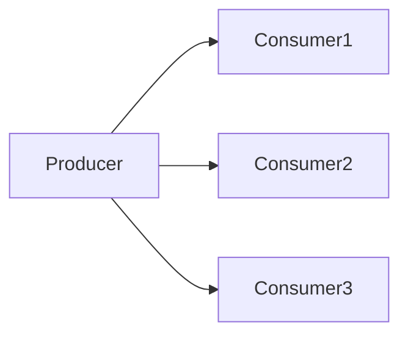
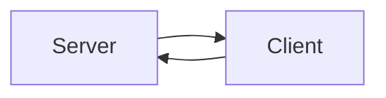
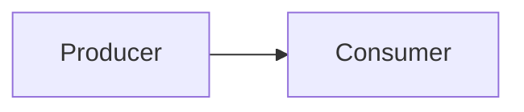

# Java UDP and TCP Communication Cook-book

Overview

This repository provides a collection of Java socket programming examples for UDP and TCP communication.

his repository provides practical Java socket programming examples for UDP and TCP communication. It showcases various networking techniques and Enterprise Integration Patterns (EIPs) such as Request-Reply, Guaranteed Delivery, Competing Consumers, Publish-Subscribe, and Point-to-Point communication.

Each example is designed to be lightweight and includes simple load tests to demonstrate real-world usage.

# - UDP Load Balancer

Class: `UDPBalancer.java` Uses: `DatagramSocket, InetAddress, DatagramPacket` from `java.net`


```mermaid
graph LR;
    Producer--|Consumer1;
    Producer-->Consumer2;
    Producer--|Consumer3;
```

This approach distributes messages among multiple receivers competitively, instead of broadcasting to all recipients.

More info: <a href="https://www.enterpriseintegrationpatterns.com/patterns/messaging/CompetingConsumers.html">Competing Consumers</a>

Features:

* Efficiently balances network load among multiple consumers.

* Ideal for distributed systems requiring dynamic message handling.

* Load balancing is achieved by multiple receivers sharing the same port, with each message processed by only one receiver.

# - UDP Broadcasting

Class: `UDPBroadcast.java` Uses: `MulticastSocket, NetworkInterface, DatagramSocket, DatagramPacket, InetAddress` from `java.net`



Uses multicast to send messages to a group of subscribed receivers.

More about: <a href="https://www.enterpriseintegrationpatterns.com/patterns/messaging/PublishSubscribeChannel.html">Publish Subscribe Channel</a>

Features:

* Allows broadcast message delivery using a multi-cast group address share single port.

* Suitable for real-time data distribution, streaming, and event notifications.

# - Reliable TCP Chat

Class: `TCPChat.java` Uses: `ServerSocket, Socket` from `java.net`



Implements a two-way, reliable Client-Server communication channel.

more about: <a href="https://www.enterpriseintegrationpatterns.com/patterns/messaging/RequestReply.html">Request-Reply</a> <a href="https://www.enterpriseintegrationpatterns.com/patterns/messaging/GuaranteedMessaging.html">Guaranteed Delivery</a>


Features:

* Ensures reliable, ordered, and error-checked message delivery.

* Suitable for chat applications, remote commands, and data transmission.

# - UDP Point-to-Point Communication

Class: `UDPUnicast.java` Uses: `DatagramSocket, InetAddress, DatagramPacket` from `java.net`



Uses DatagramSocket for direct (one-to-one) communication between sender and receiver.

More about: <a href="https://www.enterpriseintegrationpatterns.com/patterns/messaging/PointToPointChannel.html">Point To Point Channel</a>

Features:

* Low-latency and minimal overhead.

* Best suited for simple request-response scenarios.

# Getting started

Clone the repository:

```
git clone https://github.com/your-repo/user-datagram-transmission.git
```

Test the project using Maven:

```
cd user-datagram-transmission
mvn clean test
```

# Project structure

```
user-datagram-transmission/
├── src/
│   ├── main/
│   │   └── java/
│   │       └── net/
│   │           └── dev4any1/
│   │               └── udt/
│   │                   ├── TCPChat.java          # TCP-based Request-Reply implementation
│   │                   ├── UDPBalancer.java      # UDP Competing Consumers implementation
│   │                   ├── UDPBroadcast.java     # UDP Publish-Subscribe implementation
│   │                   └── UDPUnicast.java       # UDP Point-to-Point implementation
│   └── test/
│       └── java/
│           └── net/
│               └── dev4any1/
│                   └── udt/
│                       ├── BalancerTest.java     # Test for UDP Competing Consumers
│                       ├── BroadcastTest.java    # Test for UDP Publish-Subscribe
│                       ├── ChatTest.java         # Test for TCP Request-Reply
│                       └── UnicastTest.java      # Test for UDP Point-to-Point
├── pom.xml                                       # Maven build configuration
└── README.md                                     # Project documentation
```

# Notes

* Ensure that correct port numbers and IP addresses are used.

* UDP does not guarantee message delivery, whereas TCP provides reliability.

* For multicast communication, use a valid multicast IP address (224.0.0.0 - 239.255.255.255).

* Start receiver instances before sending messages to capture incoming data

# License

This project is open-source and available under the MIT License.