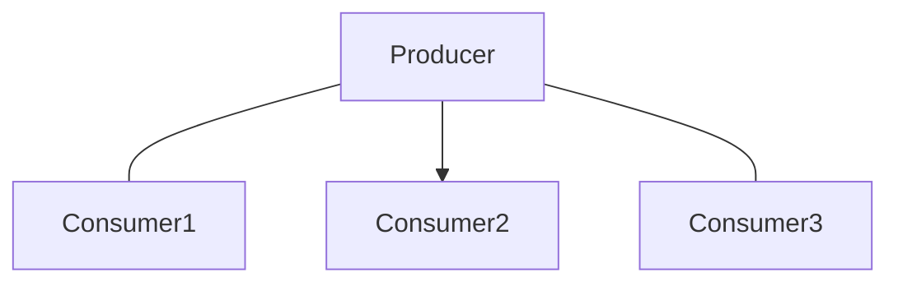
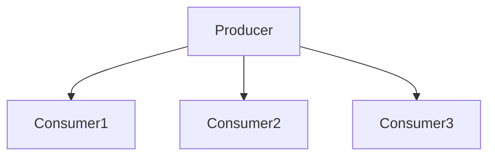
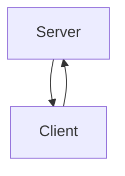
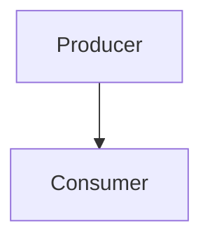

# Java UDP and TCP Communication Cook-book

Overview

This repository provides a collection of Java socket programming examples for UDP and TCP communication.

It covers different types of network communication using DatagramSocket, MulticastSocket, ServerSocket, and Socket. 

Each implementation demonstrates practical usage of Java networking features.

Communication Methods:

# UDP Load balancing 

`UDPBalancer.java:[#java.net.DatagramSocket #java.net.InetAddress]`



This method utilising the broadcast address (255.255.255.255) to distribute messages among multiple receivers in a competitive manner.

Key Features:

* Lightweight balancer of network load among multiple consumers.

* Suitable for distributed systems requiring dynamic message handling.

* Achieves load balancing by allowing multiple receivers to bind to the same port, with each message being handled by one receiver.

# UDP Broadcasting

`UDPBroadcast.java:[#java.net.MulticastSocket #java.net.NetworkInterface #java.net.DatagramSocket #java.net.InetAddress]`



Useing MulticastSocket and NetworkInterface to send messages to a multicast group, ensuring only subscribed receivers get the message.

Key Features:

* Allows selective message delivery using a multicast group address.

* Suitable for real-time data distribution, streaming, and event notifications.

# TCP Communication (TCPChat.java)



Classes: TCPServer & TCPClient

Usage: Implements reliable, two-way communication using ServerSocket (server) and Socket (client).

Key Features:

Provides reliable, ordered, and error-checked message delivery.

Ideal for chat applications, remote commands, and data transmission.

# UDP Uni-cast (UDPUnicast.java)



Classes: UDPSender & UDPReceiver

Usage: Uses DatagramSocket for direct (one-to-one) communication between sender and receiver.

Key Features:

Low overhead, fast message delivery.

Suitable for simple request-response scenarios.

Getting Started

Clone the repository:

git clone https://github.com/your-repo/user-datagram-transmission.git
cd user-datagram-transmission

Build the project using Maven:

mvn clean package

Run the desired program:

java -cp target/user-datagram-transmission-0.0.1-SNAPSHOT.jar net.dev4any1.udt.TCPChat

> Project structure

```
user-datagram-transmission/
├── src/
│   ├── main/
│   │   └── java/
│   │       └── net/
│   │           └── dev4any1/
│   │               └── udt/
│   │                   ├── TCPChat.java          # TCP-based Request-Reply implementation
│   │                   ├── UDPBalancer.java      # UDP Competing Consumers implementation
│   │                   ├── UDPBroadcast.java     # UDP Publish-Subscribe implementation
│   │                   └── UDPUnicast.java       # UDP Point-to-Point implementation
│   └── test/
│       └── java/
│           └── net/
│               └── dev4any1/
│                   └── udt/
│                       ├── BalancerTest.java     # Test for UDP Competing Consumers
│                       ├── BroadcastTest.java    # Test for UDP Publish-Subscribe
│                       ├── ChatTest.java         # Test for TCP Request-Reply
│                       └── UnicastTest.java      # Test for UDP Point-to-Point
├── pom.xml                                       # Maven build configuration
└── README.md                                     # Project documentation
```

Notes

* Ensure the correct port numbers and IP addresses are used.

* UDP does not guarantee message delivery, whereas TCP ensures reliability.

* For multicast, use a valid multicast IP address (224.0.0.0 - 239.255.255.255).

* Run receiver instances before sender instances to capture messages.

License

This project is open-source and available under the MIT License.